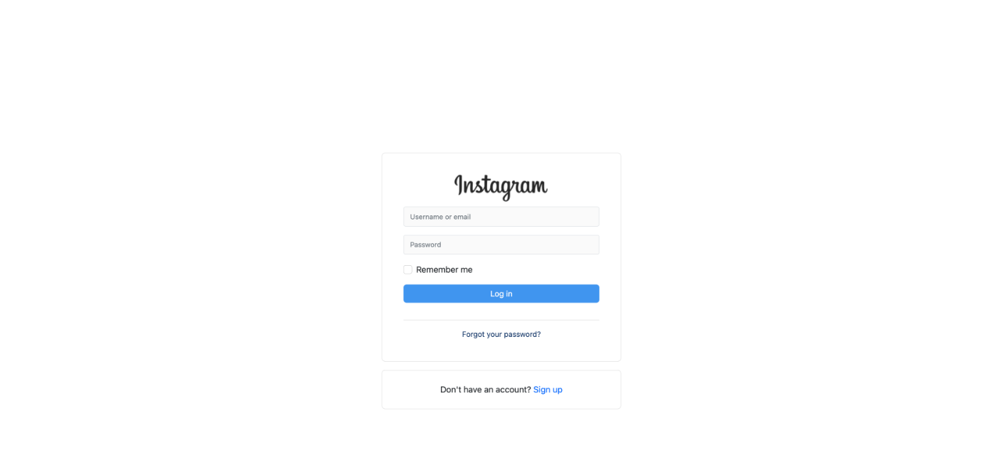
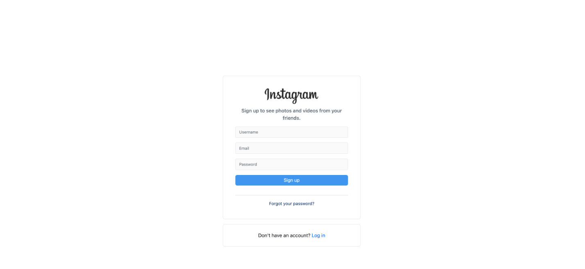

# INSTAGRAM CLONE

A clone of Instagram that allows users to sign up with a username, login with a username. Users can then post a photo and go through different models of editing the photo, such as cropping, adding filters, and typing a description. Once the photo posts everyone who is logged in can see the post and the user who posted it.

## Getting Started

### Some commands for creating new apps and more

To create new app
`rails new instagram-rails -T -d postgresql -j esbuild --css bootstrap`

To Create new DB
`bundle exec rails db:create`

To migrate
`bundle exec rails db:migrate db:test:prepare`

To generate/install devise
`bundle exec rails generate devise:install`

To generate devise user
`rails generate devise user`

To generate devise views
`bundle exec rails generate devise:views`

When SCSS file not loading or not showing-> Precompile
`rails assets:precompile`

To load the asset on page refresh
`rails assets:clobber`

To install active storage
`bundle exec rails active_storage:install`

#### Install npm

`sudo apt install npm`

#### Install Cropper Js

`npm install cropperjs`

#### Bundle Install

`bundle exec rspec`

`bundle install`

## Ruby Version

The version of Ruby used in this project is 3.0.0

If you have a different version just navigate to
`.ruby-version`

and
`Gemfile`

and add/replace/edit your ruby version with 3.0.0

## Tech Stack && Installation

- [RVM](https://rvm.io/)
- [Ruby 3.0.x/Rails 7.0.x](https://www.ruby-lang.org/en/documentation/installation/)
- [PostgreSQL](https://www.postgresql.org/download/)
- [Bootsrap](https://getbootstrap.com/docs/5.3/components/modal/)
- [Devise](https://github.com/heartcombo/devise/)
- [Image Processing](https://api.rubyonrails.org/v6.0.2.1/classes/ActiveStorage/Variant.html)
- [Detailed image processing](https://github.com/janko/image_processing)
- [StimulusJS](https://stimulus.hotwired.dev/)
- [Faker](https://github.com/faker-js/faker/)
- [Enums](https://blog.saeloun.com/2022/01/05/how-to-use-enums-in-rails/)
- [Vibs](https://rubygems.org/gems/ruby-vips)
- [Flat Icons](https://www.flaticon.com/)
- [Bundler 2.0.x](https://bundler.io/)

## Steps I took to making this project

- Started with a rails app, installed normal gems
- FAVICON
- Homepage
- Login Forms and styling them
- Register Forms and styling them
- Registering and Logging in with Username
- Separate page for Login
- Post Model
- Sidebar and styling it
- Styling Post [Model](https://getbootstrap.com/docs/5.3/components/modal/)
- File Input used [Stimulus](https://github.com/hotwired/stimulus-rails)
- I need to have the backend register the post
- Want to crop used [CropperJs](https://fengyuanchen.github.io/cropperjs/)
- Moved Cropping to the edit page
- Cropping pictures to function on backend
- Filterss! used [Pixel JS](https://silvia-odwyer.github.io/pixels.js/)
- Need to apply filter to photos
- Saving and applying filters
- Publish the photo
- Backend Models
- Homepage again

## Login

## Sign Up

## Create Post

###### Sidebar

- app/layouts/\_nav_sidebar.html.erb

###### Post Model

- app/layouts/\_create_post_model.html.erb
